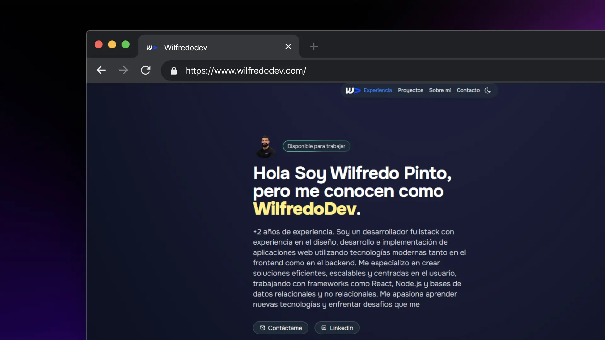

# 👨🏻‍💻 Portfolio WilfredoDev

<div align="center">
<a href="https://wilfredodev.com">

</a>
<p></p>
</div>

<div align="center">

</div>

---

Este es mi portfolio personal desarrollado con **Astro** y **Tailwind CSS**. Aquí muestro mis proyectos, habilidades y experiencia como desarrollador fullstack.

## Tecnologías utilizadas

- [Astro](https://astro.build/)
- [Tailwind CSS](https://tailwindcss.com/)

## Características

- Diseño responsivo y moderno
- Sección de proyectos destacados
- Información sobre mí y mis habilidades
- Contacto directo

## Instalación

1. Clona el repositorio:
   ```bash
   git clone https://github.com/DevWilfredo/wilfredodev-portfolio.git
   ```
2. Instala las dependencias:
   ```bash
   npm install
   ```
3. Inicia el servidor de desarrollo:
   ```bash
   npm run dev
   ```

## Licencia

Este proyecto está bajo la licencia [MIT](https://opensource.org/licenses/MIT).
